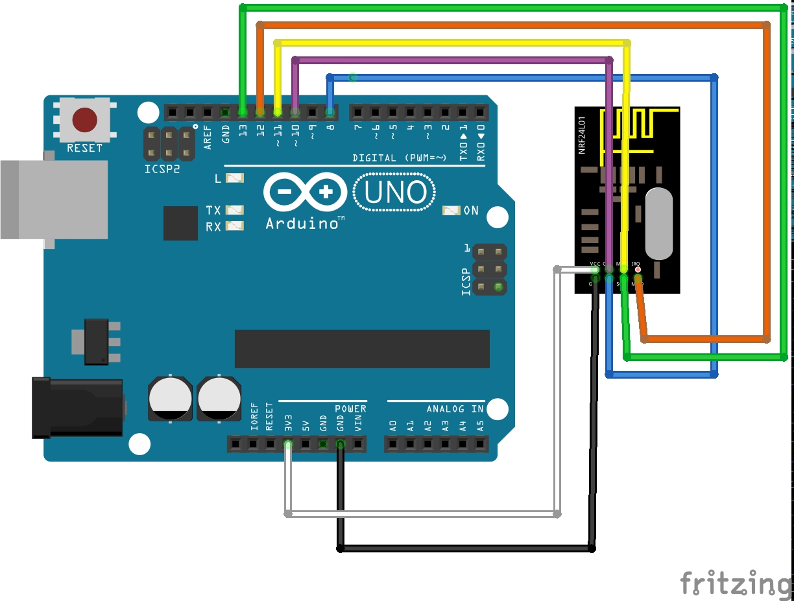

This code allows an Arduino UNO to receive messages send to MiLights via an nRF24L01.

For the communication the openmili library by henryk is used: https://github.com/henryk/openmili

Received messages are send via serial.

## Wiring

